# Saying Goodbye to AWS Access Keys

I own several personal AWS accounts, used for various purposes. About a year ago, I deleted the few long term AWS access keys that existed in these accounts and declared a new goal: never create another long-term access key again - no matter how compelling my excuse.

Long term credentials and exposed access keys are well-known allstars in the world of cloud security vulnerabilities, and it has become relatively simple to avoid using them. The improved functionality of **AWS IAM Identity Center**(formerly AWS SSO) and the AWS CLI v2 offers a robust alternative via automatic token refresh from the CLI.

This guide walks through how I set up automatic token refresh for the AWS CLI v2 for my multiple accounts. It's more secure and honestly just more convinient, especially when you are a nerd like me with a bunch of stuff going on in different AWS environments. Here is my set up:

## Prerequisites

> ✨ **Note:** When setting this all up, I mostly just followed the AWS CLI User Guide, specifically [this section](https://docs.aws.amazon.com/cli/latest/userguide/sso-configure-profile-token.html). You may find it helpful to have open whilst you are following along

This walkthrough assumes the following:

- You have already set up IAM Identity Center
- You have access to at least one AWS account via the Identity Center
- You have **[AWS CLI v2](https://aws.amazon.com/cli/)** installed
- This guide focuses on MacOS - I've never set it up on Windows

[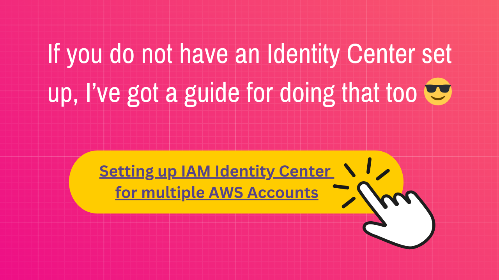](https://github.com/Tara-Cloud/aws-guides/tree/main/set-up-aws-identity-center)

## Step 1: Get Your Identity Center Information

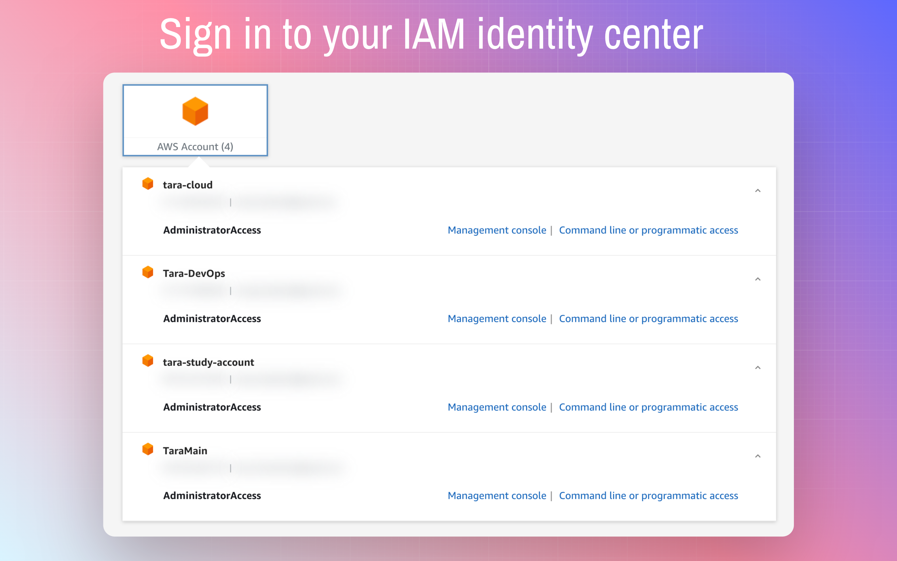

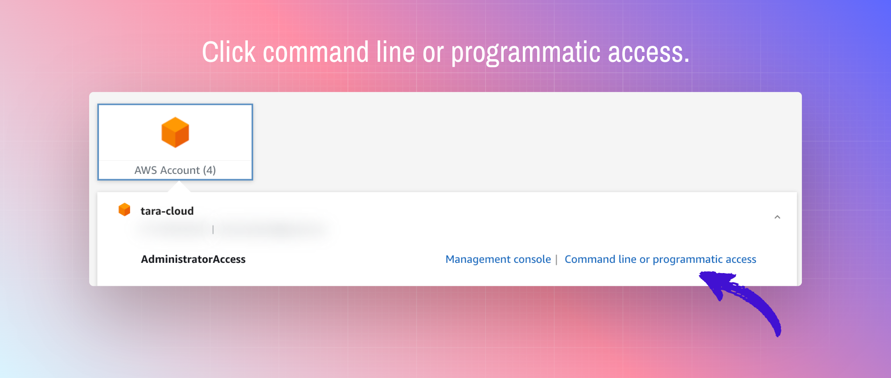

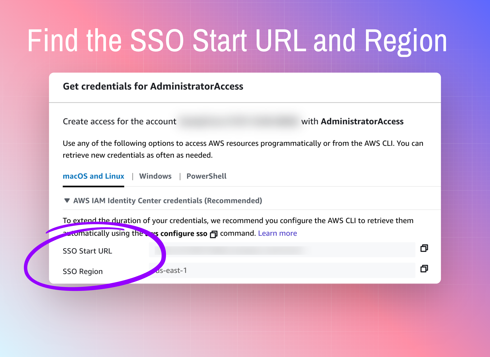

Note the **SS0 Start URL** and **SSO Region** for the next step.

## Step 2: Configure the SSO Session

Run `aws configure sso`

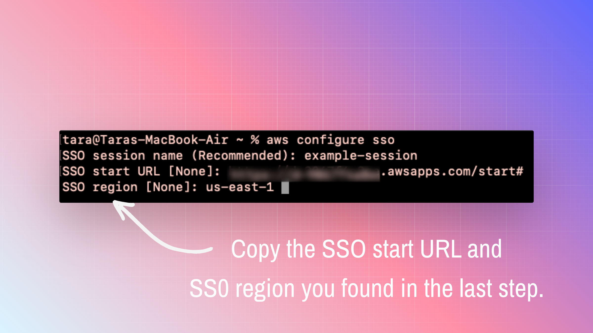

- **Session name:** You can choose anything for session name, you likely want to choose something that indicates the organization/identity center you are working in.

- **SSO start URL** and **SSO region:** use the values from the previous step

- **access scope:** most use cases default to `sso:account:access` but if you want to know more [here is a good starting point](https://docs.aws.amazon.com/singlesignon/latest/userguide/customermanagedapps-saml2-oauth2.html#:~:text=a%20refresh%20token.-,Access%20scopes,-A%20scope%20defines) to understand the different scopes available and what it all means.

I'm sticking with `sso:account:access`.

The SSO authorization page will open in your default browser.

Confirm that the code in your browser matches the code in the terminal.

Click confirm and continue.

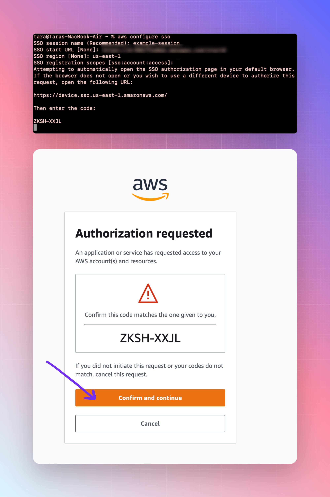
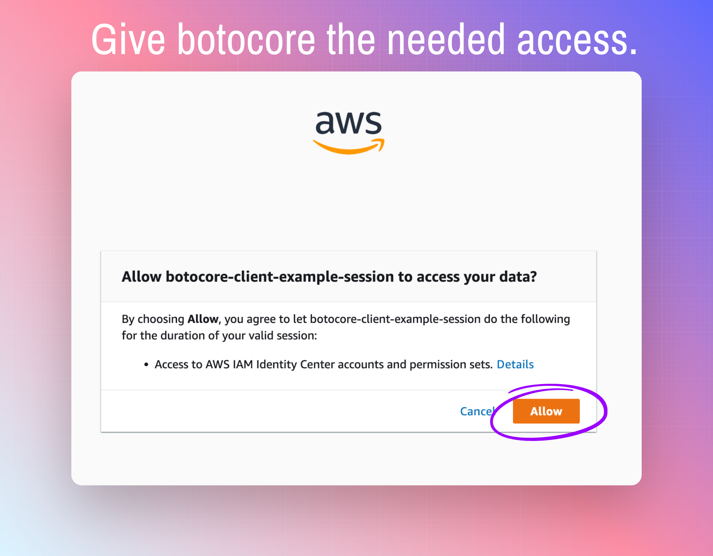
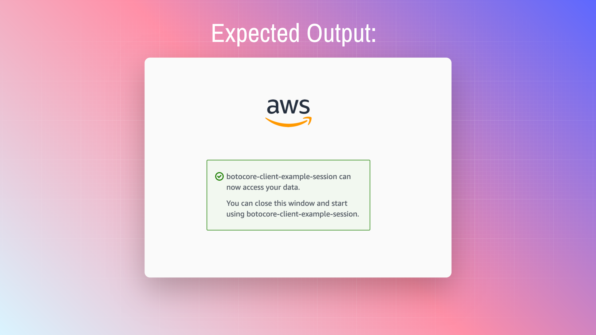

## Step 3: Configure a Profile

The profile exists at the individual AWS account level - you should use a profile name that references the specific AWS account you will be working in.

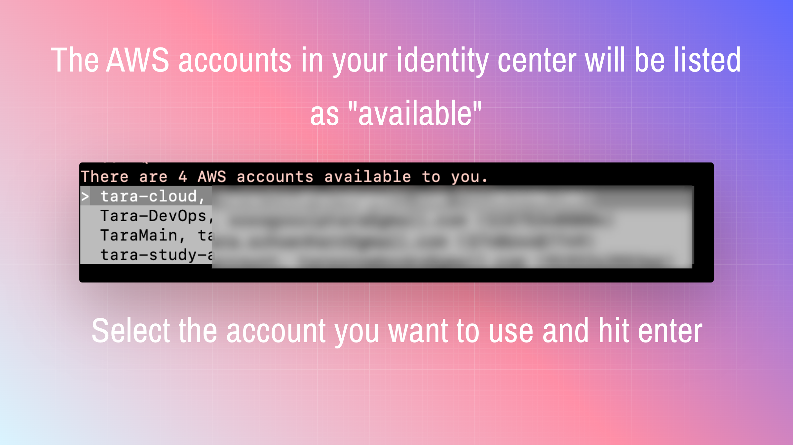
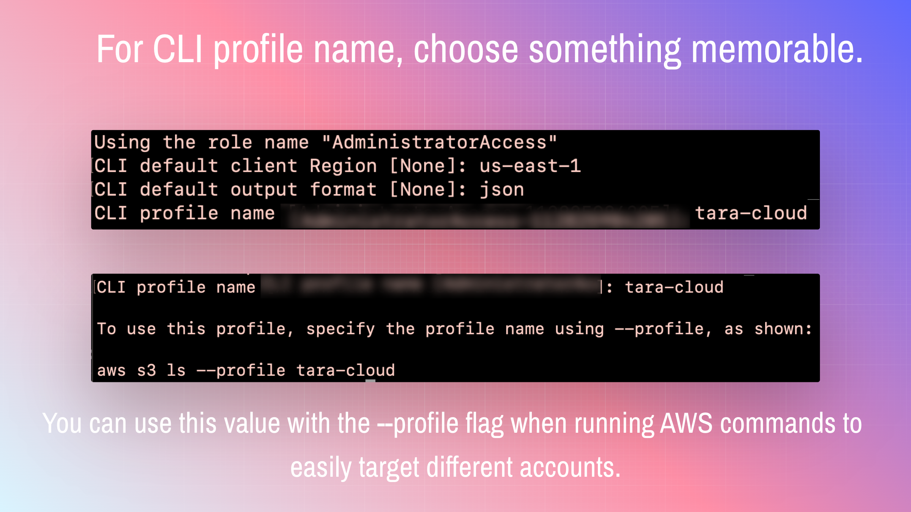
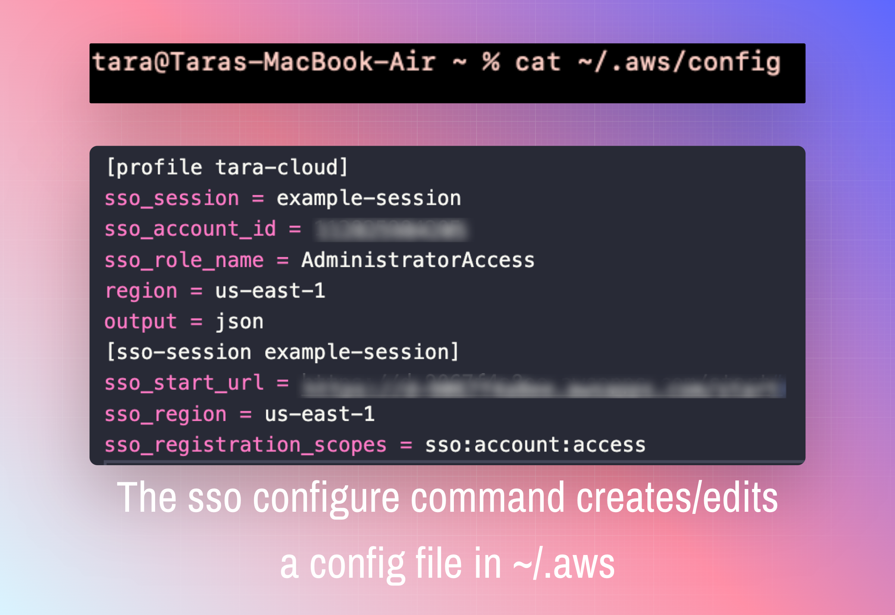

As you run the `aws configure sso` command, you are configuring the `~/.aws/config` file. You can also set up sessions and profiles by editing this config file.

## Step 4: Create Profiles for Each Account

You need to configure each account in your identity center seperately, the profile will not exist until you create it.

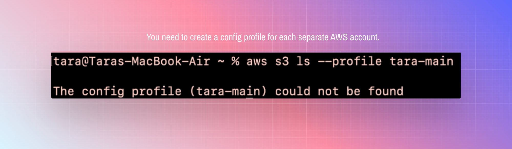

Repeat the process demonstrated in steps 2 and 3. You can reuse the same SSO session as you create each profile.

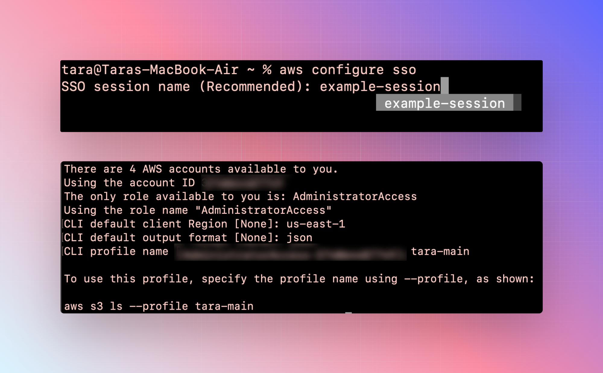

You can run `aws configure list-profiles` to see all the profiles you have configured.

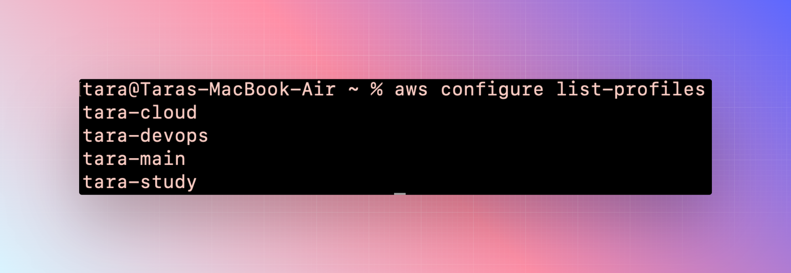

You can also refer to the `~/.aws/config` file to see all profiles and SSO sessions.

## Step 5: Using Profiles

With the profiles configured, use the `--profile` flag to target commands against different AWS accounts. You do not need any credentials stored locally and it is easy to switch betwix different accounts 🙌.

## Step 6: SSO Session Duration

When you configure a profile, you select an AWS account and then a role. (In the example above there was only one role available - the _AdminsitratorAccess_ role). The role is associated with a permission set in your IAM Identity Center. You may recall from Identity Center set up that Identity Center permission sets have a configurable duration setting.

If you own the Identity Center you are using to create sessions (or are an adminstrator), you can change the maximum duration of your sessions in the IAM Identity Center console. Navigate to IAM Identity Center > Permissions Sets > <PermissionSetName> > Edit.

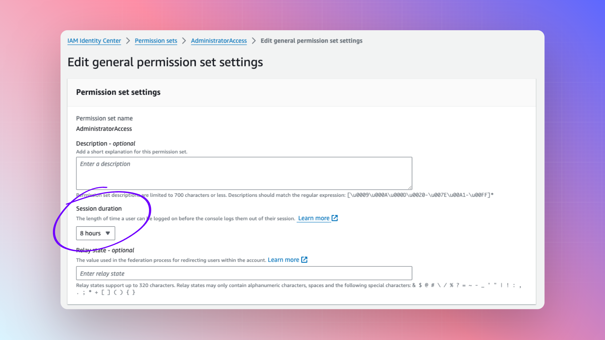

## Step 7: SSO Session Login

When your session does expire, you can run `aws sso login` to reauthenticate. You can use the `--sso-session` or `--profile` flags.

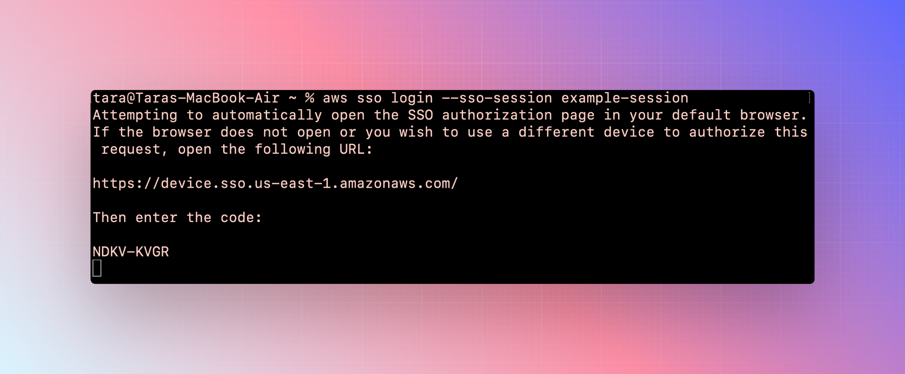

You can also logout of all active sessions at any time by running `aws sso logout`.

This command deletes cached temporary credentials that live in the `~/.aws/sso/cache` directory.

## Resources

- https://docs.aws.amazon.com/singlesignon/latest/userguide/customermanagedapps-saml2-oauth2.html
- https://docs.aws.amazon.com/cli/latest/userguide/sso-using-profile.html
- https://docs.aws.amazon.com/singlesignon/latest/OIDCAPIReference/Welcome.html
- https://aws.amazon.com/blogs/security/define-a-custom-session-duration-and-terminate-active-sessions-in-iam-identity-center/
- https://www.rhythmictech.com/blog/iam-access-keys-bad-aws-sso-good/ <---- Excellent walk through on the subject
- https://www.reddit.com/r/aws/comments/zk456d/new_aws_cli_and_sso_sessions_profiles_and_legacy/ <---- Excellent reddit post on the subject
