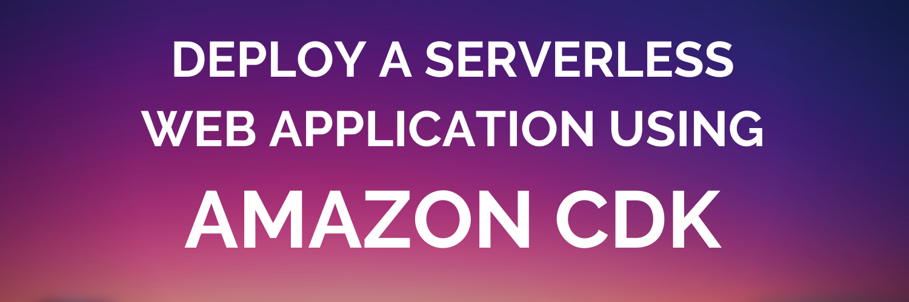
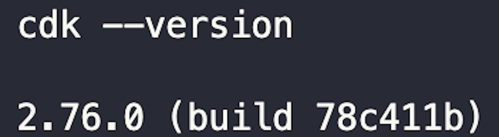

# Deploy a serverless web application using the AWS Cloud Development Kit



The [AWS Cloud Development Kit (AWS CDK)](https://aws.amazon.com/cdk/) is a framework used to define cloud infrastructure as code. With the AWS CDK, you can use your favorite object-oriented programming languages to build reliable, scalable, and secure applications in the AWS cloud without manually deploying infrastructure.

**_In this tutorial you will learn:_**

- The value proposition of the AWS CDK
- The building blocks of AWS CDK applications (constructs, apps, and stacks)
- The basic structure of AWS CDK projects
- The lifecycle of a CDK application

Once you understand what the AWS CDK is all about, you will use your new skills to deploy a website to the cloud!

**Estimated Time to Complete**: 10--20 min

**Cost**: All AWS resources deployed in this tutorial fall within the [AWS Free Tier](https://aws.amazon.com/free/free-tier-faqs/). Make sure to follow clean-up instructions in _Step 7_ of this tutorial.

## Tutorial pre-requisites

- [ ] [Node.js (>= 10.13.0)](https://nodejs.org/en)
- [ ] An [IDE](https://www.codecademy.com/article/what-is-an-ide) of your choice. You will be editing code throughout this tutorial. One great option is [VS Code](https://code.visualstudio.com/download).
- [ ] An active AWS Account and a basic understanding of [AWS Regions](https://cloudacademy.com/blog/aws-regions-and-availability-zones-the-simplest-explanation-you-will-ever-find-around/).
- [ ] [AWS Command Line Interface (AWS CLI)](https://docs.aws.amazon.com/cli/latest/userguide/cli-chap-getting-started.html)
- [ ] The AWS CLI configured with credentials for an IAM user with the `AdministratorAccess` permission policy attached. [Instructions for configuring the AWS CLI](https://docs.aws.amazon.com/cli/latest/userguide/cli-configure-files.html).

## The power of CDK

A CDK application defines a cloud application or cloud infrastructure configuration. You can deploy the same CDK application once or hundreds of times. This functionality is powerful for several reasons:

- :shield: **Security**: Define reusable components modeled to meet security best practices and your organization's security and compliance requirements. Minimize human error by modeling and sharing vetted configurations with the CDK.
- :moneybag: **Cost Savings**: Use the AWS CDK to provision and destroy entire cloud architectures quickly. Destroy cloud infrastructure when it's not needed, and avoid paying for unnecessary resources. Use the AWS CDK to redeploy the same infrastructure in seconds.
- :detective: **Best Practices Built-in**: Create and reuse patterns built using cloud best practices. Use 1000+ high-quality [existing, open-source CDK libraries](https://constructs.dev/) to deploy common cloud infrastructure patterns.

## Constructs, stacks, and apps

CDK applications are created with three essential parts: constructs, stacks, and apps.

- **Constructs**: Constructs are the building blocks of your CDK application. A construct represents a [cloud component](https://docs.aws.amazon.com/cdk/v2/guide/constructs.html) to be deployed in your cloud environment.
- **Stacks**: Stacks are the unit of deployment in the AWS CDK. Every AWS resource defined using a CDK construct must be defined within the scope of a stack. When you deploy your CDK application, you will choose whether to deploy every stack in the application, only specific stacks or even multiple copies of the same stack.
- **Apps**: A CDK application or app is a container for one or more stacks.


> :bulb:_Summary:_ A CDK application (or app) is a container for multiple stacks. A CDK stack is a container for multiple CDK constructs. CDK constructs represent a cloud component deployed to your cloud environment.

Perhaps you want to host a [serverless web application](https://catalog.us-east-1.prod.workshops.aws/workshops/b0c6ad36-0a4b-45d8-856b-8a64f0ac76bb/en-US) in the cloud. Here is an example of a typical serverless architecture:


> :bulb:_Tip:_ This application is serverless because it can be built and maintained without provisioning and maintaining servers. AWS abstracts away all server management.

This serverless web application could easily be deployed using the AWS CDK.


> :bulb:_Tip:_ Apps, stacks, and constructs promote modularity and reuse.

## CDK application lifecycle

Familiarizing yourself with common CDK commands is a great way to familiarize yourself with the overall lifecycle of a CDK application. Take a moment to review the graphic below. These commands are the same for Windows, Linux, and macOS users.


_\*CDK applications synthesize to files called CloudFormation templates. `cdk synth` is out of scope for this tutorial but will be covered in future courses. Check out the [CloudFormation User Guide](https://docs.aws.amazon.com/AWSCloudFormation/latest/UserGuide/Welcome.html) to learn more._

## Build a CDK app

It's time to get hands-on and deploy your first CDK application! You will use the AWS CDK to configure and deploy a simple static S3 website hosted in the AWS cloud.

> :bulb:_Tip:_ Remember to review the list of pre-requisites at the beginning of the tutorial.

> :bulb:_Tip:_ If you get stuck you can see the code for the completed solution located in the `cdk_static_website_COMPLETED/` directory within this repository.

## Step 1: Configure your development environment

### Install the AWS CDK toolkit

Open your terminal or command line interface of choice.

The AWS CDK Toolkit is a command-line utility that you will use to orchestrate your CDK applications. Windows, Mac, and Linux users can install the CDK Toolkit by running the following command:

_Note: Windows users should run this command as an Administrator and Mac/Linux users should run this command using `sudo`_

`npm install -g aws-cdk`

Verify your AWS CDK Toolkit installation by running

`cdk --version`

_Example Output:_



### Select your programming language

AWS CDK allows you to model and deploy cloud infrastructure using your object-oriented programming language of choice. No need to learn new syntax! CDK is currently available for TypeScript, JavaScript, Python, Java, C#, and Go.

Depending on your choice of programming language, you may encounter additional prerequisites. For this tutorial, you will be using Python, and you need the following tools installed on your system:

- [ ] [Python version 3.6 or greater](https://www.python.org/downloads/)
- [ ] [Python package installer (pip)](https://pip.pypa.io/en/stable/installation/)

Verify your Python installation by running
`python --version` or `python3 --version`

_Example Output:_


## Step 2: Create your first CDK application

### Initialize a CDK project

Create an empty directory where your CDK application will live:

`mkdir cdk_static_website && cd cdk_static_website`

The `cdk init` command creates a new, empty CDK project. You can run `cdk init --help` to see the options available.

You will create a new CDK project using a sample-app template and build your CDK application using Python. Run the `cdk init` command using the following options:

`cdk init sample-app --language python`

_Example Output:_


### Activate your virtual environment and install the required modules

A virtual environment allows you to install packages and run your Python application without impacting the Python installation on your system. [Learn more about virtual environments](https://docs.python.org/3/tutorial/venv.html).

Activate your virtual environment by running the following command. Make sure you are in your `cdk_static_website/` directory.

Linux/macOS:

`source .venv/bin/activate`

Windows:

`.venv\Scripts\activate.bat`

> Your Python installation should have virtual environment functionality built in. If your virtual environment activation fails you may need to manually create a virtual environment by running `python3 -m venv .venv`

Once you have activated your virtual environment, you can install the required Python modules for your project by running

`pip install -r requirements.txt`

Now you are ready to work with CDK!


In initializing your project, the CDK Toolkit has created several pre-configured files and directories for you. [Read more about CDK project structure and components](https://cdkworkshop.com/30-python/20-create-project/300-structure.html).

- **_app.py_**: the entry point for your CDK application, similar to a "main" file.
- **_cdk_static_website/cdk_static_website.py_**: a Python file that creates a custom CDK stack for use in your CDK application. You will learn more about stacks when you model and deploy your application. A production CDK application will likely grow to have several different files defining several different stacks.
- **_cdk.json_** A configuration file for CDK that defines several aspects of your application and how it should operate.
- **_README.md_**: A README describing your CDK application and basic deployment steps. You can find several useful tips and CDK commands in the README. Eventually, you should customize this README file to be specific to the CDK application you build.
- The CDK toolkit also initialized a [Git repository](https://www.gitkraken.com/learn/git/tutorials/what-is-a-git-repository) in the project directory and populated a [.gitignore file](https://git-scm.com/docs/gitignore) that you can modify as needed.

## Step 3: Bootstrap your AWS account

An AWS environment is a combination of the AWS account and AWS region where you are provisioning your cloud resources. You prepare your AWS environment using a process called CDK Bootstrap. The CDK Bootstrap script will provision several resources in your AWS environment. CDK will rely on these resources behind the scenes when your applications are being deployed.

Bootstrapping an AWS environment is a one-time process. You will only need to rerun CDK Bootstrap if you start deploying CDK applications in different AWS regions or a different AWS account. [Read more about CDK Bootstrap](https://docs.aws.amazon.com/cdk/v2/guide/bootstrapping.html)

Bootstrap your AWS environment by running:

`cdk bootstrap`

_Example Output:_


## Step 4: Design your application

Remember that the unit of deployment in the AWS CDK is called a **_stack_**. Within your CDK stacks you will use Python to define the resources you want to provision in the AWS cloud. Get started by opening `cdk_static_website/cdk_static_website_stack.py`. The file in its current state looks like this:


> :bulb:_Tip:_ If your IDE gives you warnings like `Import "aws_cdk" could not be resolved` the most likely cause is an IDE misconfiguration related to your Python interpreter. Fixing this is out of the scope of this tutorial. If you have followed all the previous instructions correctly, you can safely ignore these warnings.

This example code will deploy two AWS resources: a [Amazon SQS Queue](https://aws.amazon.com/sqs/) and a [Amazon SNS Topic](https://aws.amazon.com/sns/).

Delete the existing code in `cdk_static_website_stack.py` and replace it with the following code block:

```
from constructs import Construct
from aws_cdk import (
    Stack,
    aws_s3 as s3,
    aws_s3_deployment as s3_deploy,
    RemovalPolicy,
)

class CdkStaticWebsiteStack(Stack):

    def __init__(self, scope: Construct, construct_id: str, **kwargs) -> None:
        super().__init__(scope, construct_id, **kwargs)

        #create a s3 bucket to host our static website
        static_website_bucket = s3.Bucket(self, "StaticS3Bucket",
            public_read_access=True,
            block_public_access=s3.BlockPublicAccess(restrict_public_buckets = False),
            website_index_document='index.html',
            website_error_document='error.html',
            removal_policy= RemovalPolicy.DESTROY,
            auto_delete_objects=True
        )

        #upload the html documents from s3-assets/ directory to the S3 bucket
        deployment = s3_deploy.BucketDeployment(self, "DeployWebsite",
            sources=[s3_deploy.Source.asset("../s3-assets")],
            destination_bucket=static_website_bucket
        )
```

This block of code imports several CDK modules and then uses those modules to model cloud infrastructure. Specifically, you are defining the CdkStaticWebsiteStack. The CdkStaticWebsiteStack will include two constructs:

- a [S3bucket construct](https://docs.aws.amazon.com/cdk/api/v1/python/aws_cdk.aws_s3/Bucket.html) configured with the necessary settings to support static website hosting. This construct will create a new S3 Bucket in your AWS cloud environment.
  > :rotating*light: \_SECURITY ALERT* :rotating_light: Most S3 bucket deployments will be configured to set the block_public_access property to true. This project uses a special S3 bucket configuration designed for website hosting. It is critically important that you do not store ANY files or objects in this S3 bucket other than files you want publicly available on a public website.
- a [BucketDeployment construct](https://docs.aws.amazon.com/cdk/api/v2/python/aws_cdk.aws_s3_deployment/BucketDeployment.html) which is used to upload assets to your newly created bucket. In this project, you are using BucketDeployment construct to upload the HTML files you want to serve from your bucket.

> :bulb:_Tip:_ When designing and coding your CDK applications, you will use the [CDK API documentation](https://docs.aws.amazon.com/cdk/api/v2/python/modules.html) to make decisions about what code to write. You can see examples of the CDK API documentation by clicking the S3Bucket and BucketDeployment construct links above.

Open the `app.py` file located in the root of your project directory.

You do not need to make any changes to `app.py`, but look at what is happening here. `app.py` is the application entry point, meaning when you deploy your CDK application, the deployment process will begin by running the code in `app.py`.


In your static website app you are only deploying one stack, but here is an example of what `app.py` might look like for a production-scale CDK application with multiple stacks:


## Step 5: Deploy your application

You have successfully designed your CDK application using constructs and stacks. It's time to get this website in the cloud!

The `cdk deploy` command will trigger the deployment of resources in your account based on the code in your CDK app.

Run:

`cdk deploy`

_Example Output:_


> :rotating*light: \_Security Alert:* :rotating_light: You will be asked to review any Identity and Access Management (IAM Changes) that will be made when your CDK application is deployed. This step adds awareness of security implications for your cloud environment resulting from this deployment. In production, you should review these changes closely. Here you can select **y** to approve the changes and deploy the stack.

Upon successful deployment, you are given a _Stack ARN_. ARN stands for Amazon Resource Number and is a unique identifier within AWS.

You can open the AWS console and navigate to the CloudFormation console. The CloudFormation console allows you to view your newly deployed stack and the resources it holds.


> :bulb:_Tip:_ Did you notice another stack in your CloudFormation console called _CDK Toolkit_? This stack was deployed by you earlier when you ran `cdk bootstrap`.

## Step 6: Update your application

Your CDK application deployment succeeded, and your S3 Website is live and running. You can manually find the address of your new website using the S3 console within AWS, but that's a pain. Wouldn't getting the website address as an output once your stack is deployed be better?

This is a great opportunity to practice iterative development and improve your application by making an update to your CDK code.

Open `cdk_static_website\cdk_static_website_stack.py` and make a few edits.

You will import the Cfn output CDK module and use it to output information about the resources you deploy.

Update the imports at the top of your file to include CfnOutput as an imported Python class:

```
from constructs import Construct
from aws_cdk import (
    Stack,
    aws_s3 as s3,
    aws_s3_deployment as s3_deploy,
    RemovalPolicy,
    CfnOutput
)
```

At the bottom of the file (after the S3 deployment construct) add:

```
#output S3 bucket URL when stack is deployed
CfnOutput(self, "S3 Website Url", value=static_website_bucket.bucket_website_url)
```

Increase the security posture of your web app by enforcing access logging on your s3 bucket. Add a line of code to your S3 bucket construct. Replace your current bucket construct with a construct that enforces server access logging and deploys a second, private S3 Bucket for log storage.

```
#create a S3 bucket to host our static website
static_website_bucket = s3.Bucket(self, "StaticS3Bucket",
    public_read_access=True,
    block_public_access=s3.BlockPublicAccess(restrict_public_buckets = False),
    website_index_document='index.html',
    website_error_document='error.html',
    removal_policy= RemovalPolicy.DESTROY,
    auto_delete_objects=True,
    server_access_logs_bucket= s3.Bucket(self, 'static_website_logging_bucket')
)
```

After making these changes, `cdk_static_website\cdk_static_website_stack.py` should look like this:


Implement your changes by running

`cdk deploy`

Remember to select _y_ when prompted to approve the new deployment.


_Example Output:_


Awesome! Now you can click on the link output in your terminal and see your brand new _Hello World_ website deployed using the AWS CDK.

> :bulb:_Tip:_ Curious about the error.html document you reference in your S3 bucket configuration? Append error.html to the end of your S3 Website address and see what happens. Because you correctly configured your S3 Bucket construct, your bucket is already set up to route web traffic like a traditional web server. If users enter an invalid address, they will be redirected to either the index.html or error.html files you deployed to your bucket using CDK.

 

## Step 7: Destroy your application

It's time to practice the last step of the CDK application lifecycle and tear down your application. Delete every resource at once by destroying the entire CDK stack.

Run:

`cdk destroy`

_Example Output:_


Select **Y** to approve the deletion of the CDK stack.

> :bulb:_Tip:_ Make sure to complete step 7 and destroy all resources to avoid incurring future AWS charges.

## Summary

Great job!

In this tutorial you learned:

- the basic structure of an AWS CDK application
- why the AWS CDK is a powerful tool for deploying cloud infrastructure
- how to design and deploy a basic CDK application

Continue your CDK learning path with more great labs and resources below:

### What to build next

Want to keep building your skills? There are several different AWS architecture patterns you can practice implementing to make this web app more secure and useful.

- [Deploy a serverless web app using S3 and API Gateway with Cognito Authentication](https://aws.amazon.com/getting-started/hands-on/build-serverless-web-app-lambda-apigateway-s3-dynamodb-cognito/)
- [Deploy a React app on Amazon S3](https://docs.aws.amazon.com/prescriptive-guidance/latest/patterns/deploy-a-react-based-single-page-application-to-amazon-s3-and-cloudfront.html)

### Continuing education resources:

- [AWS CDK on GitHub](https://github.com/aws/aws-cdk)
- [AWS CDK User Guide](https://docs.aws.amazon.com/CDK/latest/userguide)
- [The CDK Workshop](https://cdkworkshop.com/)
- [AWS CDK FAQs](https://aws.amazon.com/cdk/faqs/)
- [Securing your AWS CDK Deployments](https://aws.amazon.com/blogs/devops/secure-cdk-deployments-with-iam-permission-boundaries/)
