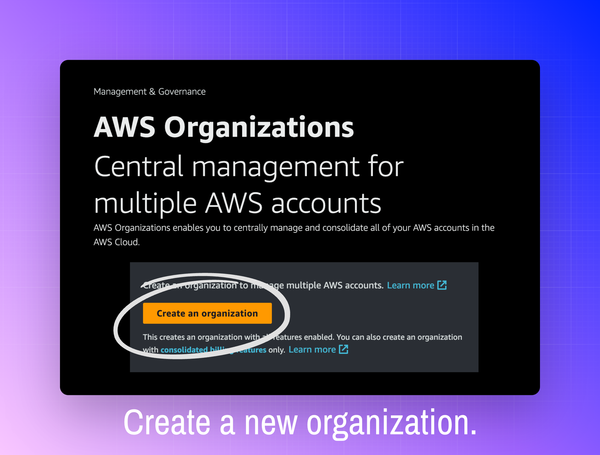
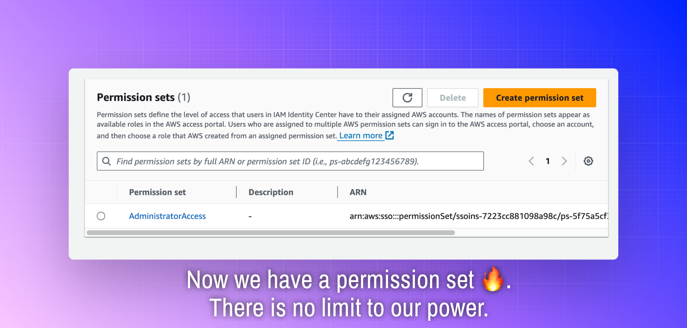

# Setting up Identity Center for multiple AWS Accounts

I have several AWS accounts and I want to make sure I am managing them wisely. I have multiple long term accounts I use to keep seperate projects seperate. Every once in a while I create a new account to go through a training course, or to study for a specific exam so that I can easily nuke the account when I'm done. I'm just talking about my own dinky little personal AWS accounts here, but AWS actually has a [whole white paper about the benefits of using multiple AWS accounts](https://docs.aws.amazon.com/whitepapers/latest/organizing-your-aws-environment/benefits-of-using-multiple-aws-accounts.html), which gives more insight into why the multi-account structure is good and explains this in the context of large AWS workloads.

The point is, I believe in the multiple AWS account model, but I do find it annoying to navigate between the console for different accounts. Also, I don't like having a bunch of acccess keys for different accounts floating around when I configure my CLI or programmatic access for the SDKs. It's gross.

I've known for a while that [AWS IAM Identity Center](https://aws.amazon.com/iam/identity-center/) solves this problem. I've used it in multiple workplace settings and it works beautifully in my experience 👩‍🍳. I have long had aspirations of setting up an Identity Center for my personal accounts, but for some reason I assumed it was going to be complicated to set it up for personal use.

I was wrong, setting up IAM Identity Center is not hard at all. It took me less than an hour to do it, just bumbling around the AWS console and I wish I did it a long time ago. I decided to write this little guide in case anyone else has been wanting to do the same thing, but isn't sure how to get started.

## About IAM Identity Center

IAM Identity Center has a [lot of functionality](https://aws.amazon.com/iam/identity-center/faqs/) and I won't even scratch the surface of it here. For my purposes, the important part is that an Identity Center provides a centralized hub where I can manage access to multiple AWS accounts.

When I want to access on of my AWS accounts, I can go to my Identity Center, and create a temporary session as a federated user into the target account. I can log in to the AWS console for each account with one click, and I can generate temporary credentials for the command line. This means I can use tools like the AWS CLI, Terraform, CloudFormation, CDK etc without having to create persistent access keys. My Identity Center access keys will expire at the end of each session, and when they expire, they become useless to any bad actor who might compromise them.

It's a win for security and a win for convience. Here is what I did to set it up:

## Prerequisites

Before you get started, make a list of the accounts you want to access from your identity center. I did this by scrolling through the authenticator app I use for MFA to remind myself of my different accounts (I have MFA set up in every account I create).

For each secondary account you need either the account number or the owner email. I gave each account a litte name, but that's just for my own reference.

You need to have access to each of these accounts, you will be logging in to them and accepting invitations to an organization in the main account.

Choose one account to serve as a management account. For me I have a personal account that is my ride or die AWS account. It's the first account I ever created and I have a lot of stuff in there. Throughout this guide I will refer to that account as the main account or management account. I'll refer to my other accounts as secondary accounts.

_Note: [It's up for debate if AWS account numbers are sensitive information](https://www.lastweekinaws.com/blog/are-aws-account-ids-sensitive-information/), but I still blur them out because it gives me mental peace 🤷‍♀️._

This guide is about enabling Identity Center to manage multiple AWS accounts. For this we need an [AWS Organization](https://docs.aws.amazon.com/organizations/latest/userguide/orgs_introduction.html?icmpid=docs_sso_console).

## Step 1: Create an Organization

🚨**Important**
There are several implications of creating an AWS Organization:

- [Consolidated billing](https://docs.aws.amazon.com/awsaccountbilling/latest/aboutv2/consolidated-billing.html) - the management account will be billed for the activity of all the accounts in the organization.
- [Free tier](https://aws.amazon.com/free/free-tier-faqs/#:~:text=Q3%3A%C2%A0What%20do%20I%20need%20to%20do%20to%20qualify%20for%20the%20AWS%20Free%20Tier%3F) - only one account in an organization can take advantage of free tier.
- An AWS account can only be part of one organization at a time. Therefore, if any of your existing accounts are already part of an organization, they will need to leave that organization in order to join the new organization you are creating. If the main account is already the manager of an organization, you can use that organization to set up the Identity Center.

That's all fine with me, so let's get started. If you are following along, make sure you are logged into the account you want to use as your main/management account.

## Step 2: Add your accounts to the organization

In the AWS Organizations console you can confirm the accounts that have pending invitations to the org.

Each secondary account needs to accept the invitation. You can do this in two ways:

### Option 1: Accept the invitation via email

Access the email account of the AWS account owner to accept the organization invite.

### Option 2: Accept the invitation directly from the AWS console

You can also log in to the invited account, navigate to the AWS Organizations console and the invitation will be there waiting for you.

Each secondary account needs to accept the invitation.

Success! Once every account is part of the organization, you are ready to create your ✨ Identity Center ✨.

## Step 3: Create the Identity Center

For me, with my organization already in place, Identity Center knew to use that organization.

Once Identity Center is enabled, your Identity Center console will have a link to your new **AWS access portal URL**. This is the URL you will use to access your AWS accounts.

When you follow the link, you will be prompted to sign in. Your regular AWS account credentials will not work here.

We need to create an Identity Center user that we can use to sign in to the access portal.

## Step 4: Create a new user

Return to the Identity Center console and find Users in the left navigation pane.

There are several other options you can configure for the user, but I didn't do that. Hit next to create the user.

Now our identity crisis is over and we have credentials for our new Identity Center user. Let's use the new creds to log in to the Identity Center.

If you have been following along with this guide, your organization probably requires MFA and you will be prompted to set it up here.

You probably also need to create a new, persistent password - make sure it's a strong one!

With MFA and the password set up, you can now log in to the Identity Center, very exciting!

Except...

We are not quite done, now we need to create something called a permission set.

## Step 5: Create a Permission Set

Now we will configure the permission set to determine how much access a user who federates via the Identity Center should have in our accounts. I am going to use a higher risk configuration, make sure to read the notes in the screenshot below.

💎 Identity Center grants access using sessions with temporary credentials. Even with a highly permissive permission set, Identity Center is far preferable to generating persistent access credentials via IAM. It's a security win overall in my opinion.

Speaking of sessions, we get to decide how long a session (and therefore a set of temporary credentials) should be valid for.

Finish creating the permission set.

## Step 6: Apply the Permission Set to Specific Accounts

## Step 7: Go back to the Access Portal

Now the pieces are all in place, and we are ready to log in to a fully functioning Identity Center.

## Step 8: Using the Identity Center

Now that we have the Identity Center up and running, it's super easy to access all of our AWS accounts. It's one click to access the AWS console.

We also have easy access to credentials for the AWS CLI, AWS SDKs, and other programmatic use cases like deploying 😍✨ infrastructure as code ✨😍.

## 🚨 REMINDER: MAKE SURE MFA IS REQUIRED FOR YOUR IDENTITY CENTER

## 🙇‍♀️ Conclusion, Resources, and Future Goals

Thanks for reading. I hope to create a video walkthrough to go along with this guide and I'll add that link here if I ever actually have time to do it 😃.

Now that I've set the whole thing up with ClickOps, my next goal is to automate using Infrastructure as Code and if I succeed, I'll share that as well.

This little tutorial encompasses a specific use case involving small scale personal accounts. [AWS IAM Identity Center User Guide](https://docs.aws.amazon.com/singlesignon/latest/userguide/what-is.html) gives insight into all the other things IAM Identity Center can do.

If you have any questions, comments, or corrections please feel free to reach out to me on my website [ link to come ].
